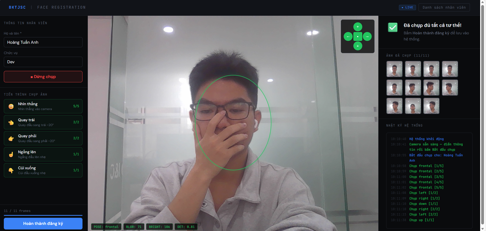
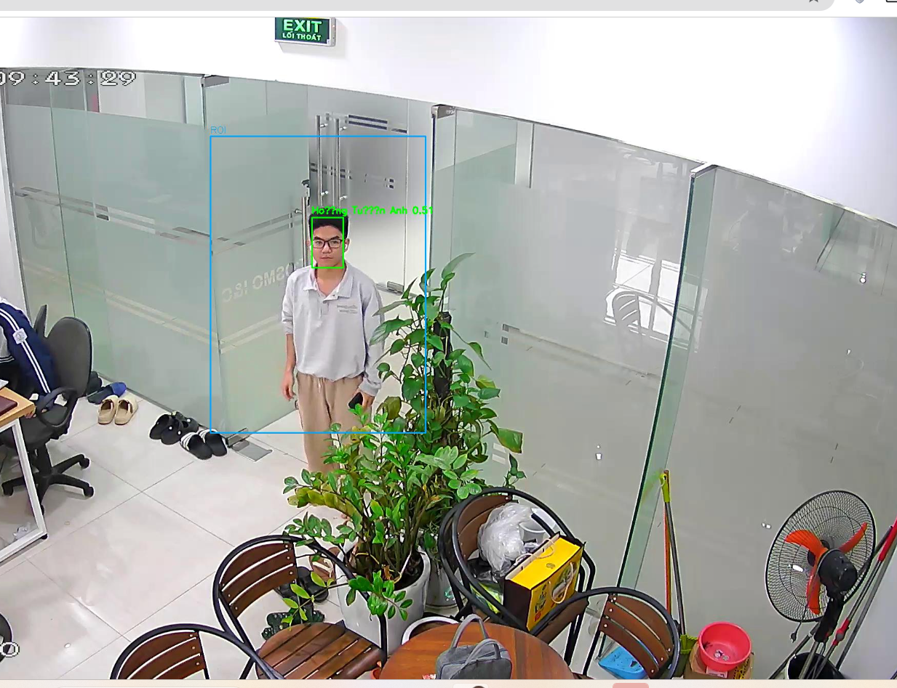
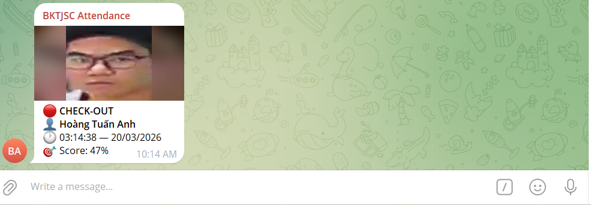

# Face Attendance System

> Real-time face recognition attendance system using InsightFace + FastAPI + Telegram notification


---

## Demo

| Face Registration | Realtime Detection | Telegram Notification |
|---|---|---|
|  |  |  |

---

## Problem Statement

Manual attendance tracking in companies is time-consuming and error-prone. This system automates the process using a fixed RTSP camera at the office entrance — employees are automatically checked in/out when passing through the door, with instant Telegram notifications to a company group.

---

## System Architecture

```
┌─────────────────────────┐         ┌──────────────────────────────┐
│   face_registration     │         │   face-attendance-mvp        │
│   App (port 8001)       │─SQLite─▶│   App (port 8501)            │
│   Employee self-enroll  │         │   Realtime RTSP recognition  │
└─────────────────────────┘         └──────────────────────────────┘
          │                                       │
          ▼                                       ▼
   employees.db                           attendance.db
   face_embeddings                         attendance_log
   (512-d ArcFace vectors)                 recognition_events
                                                  │
                                                  ▼
                                          Telegram Group
```

### Data Flow

```
RTSP Camera (25 FPS)
      │
      ▼ camera_reader() [dedicated thread]
  latest_frame
      │
      ▼ gen_frames() [every 40ms]
  Crop ROI → Resize 640×480
      │
      ▼ InsightFace buffalo_l
  RetinaFace detect → 5 landmarks
  ArcFace R50       → 512-d embedding
      │
      ▼ Cosine similarity vs DB
  score >= 0.45 → name
      │
      ▼ Consecutive confirmation (K=5 frames)
  _handle_attendance()
      │
      ├── First seen today → CHECK-IN  → INSERT attendance_log
      └── Already checked in → CHECK-OUT → UPDATE attendance_log
                │
                ▼ asyncio.Queue (non-blocking)
          telegram_worker() → sendPhoto API → Telegram Group
```

---

## Key Technical Decisions

### 1. Face Recognition Pipeline
- **Model:** InsightFace `buffalo_l` (RetinaFace detector + ArcFace R50 w600k_r50)
- **Embedding:** 512-d L2-normalized vector, cosine similarity search
- **DB search:** Raw embeddings (not mean-pooled) → argmax cosine → better accuracy across poses
- **Threshold:** `SIM_THRESHOLD=0.45` tuned on internal test set

### 2. Head Pose Estimation
- **Method:** `cv2.solvePnP` with EPnP algorithm on 5 RetinaFace landmarks
- **Output:** Yaw/Pitch/Roll Euler angles (ZYX convention via Rodrigues decomposition)
- **Camera calibration:** Pitch offset correction (`+54°` for overhead webcam setup)
- **Pose classes:** frontal / left / right / up / down → guides user during enrollment

### 3. Multi-pose Enrollment
- Captures 11 frames across 5 poses (frontal×5, left×2, right×2, up×1, down×1)
- Quality check per frame: blur score (Laplacian variance ≥60), brightness (40–220), face ratio
- Auto-capture when quality + pose both pass

### 4. Attendance Logic
- **Consecutive confirmation:** 5 consecutive recognized frames before triggering event → filters false positives
- **Check-in:** INSERT OR IGNORE (atomic, once per day)
- **Check-out:** UPDATE with 5-minute cooldown (last-write-wins pattern)
- **Threading:** camera thread → sync, Telegram → async via `run_coroutine_threadsafe`

### 5. Storage Design
```
employees.db    → master data (face_registration app)
attendance.db   → operational data (attendance app)

attendance_log:  1 row per person per day
  UNIQUE(employee_id, date) constraint
  → guaranteed single check-in entry

recognition_events: raw log every recognition
  → used for threshold tuning, FAR/FRR analysis
```

---

## Evaluation Results

Tested on internal dataset (1 employee, 4 scenarios):

| Scenario | Frames | Prediction | Confidence |
|---|---|---|---|
| normal.mp4 | 11 | ✓ correct | 91% |
| motion.mp4 | 7 | ✓ correct | 71% |
| head_turn.mp4 | 5 | ✓ correct | 60% |
| occlusion.mp4 | 4 | ✗ Unknown | 75% |

```
Accuracy (event-level) : 3/4 = 75%
FRR (missed employee)  : 25%  ← occlusion case (mask)
FAR (false accept)     : N/A  ← no unknown samples yet
```

Occlusion failure root cause: ArcFace R50 not trained on masked faces → embedding drifts from prototype vector. Fix: add masked enrollment samples.

---

## Tech Stack

| Component | Technology |
|---|---|
| Face detection | RetinaFace (InsightFace buffalo_l) |
| Face recognition | ArcFace R50, trained on WebFace600K |
| Pose estimation | OpenCV solvePnP (EPnP) |
| Backend | FastAPI + Uvicorn |
| Database | SQLite (WAL mode) |
| Async messaging | asyncio.Queue + aiohttp |
| Notification | Telegram Bot API (sendPhoto) |
| Camera | OpenCV VideoCapture (RTSP/FFMPEG) |
| ML Runtime | ONNX Runtime (CUDA) |

---

## Project Structure

```
face-attendance-mvp/
├── main.py                       # FastAPI app — entry point
├── attendance_system/
│   ├── attendance_db.py          # SQLite schema + CRUD
│   ├── attendance_service.py     # check-in/check-out business logic
│   └── telegram_notifier.py     # async Telegram worker
├── ARCHITECTURE.md               # detailed system design
└── .env.example                  # environment variables template

face_registration/
├── main.py                       # enrollment FastAPI app
├── pipeline.py                   # detect + pose + quality + embed
├── database.py                   # SQLite + FAISS operations
└── static/register.html         # self-enrollment web UI
```

---

## Setup & Run

```bash
# 1. Install dependencies
pip install fastapi uvicorn insightface opencv-python aiohttp scipy

# 2. Configure environment
cp .env.example .env
# Edit .env: RTSP_URL, TELEGRAM_BOT_TOKEN, TELEGRAM_CHAT_ID

# 3. Enroll employees (face_registration app)
cd face_registration && python main.py
# Open http://localhost:8001/register

# 4. Run attendance system
cd face-attendance-mvp
source .env && python main.py
# Open http://localhost:8501/video
```

---

## Environment Variables

| Variable | Description |
|---|---|
| `RTSP_URL` | Camera RTSP stream URL |
| `TELEGRAM_BOT_TOKEN` | Telegram bot token from @BotFather |
| `TELEGRAM_CHAT_ID` | Target group chat ID (negative number) |
| `SIM_THRESHOLD` | Cosine similarity threshold (default: 0.45) |
| `DET_THRESHOLD` | Detection confidence threshold (default: 0.6) |
| `CHECKOUT_COOLDOWN` | Seconds between checkout updates (default: 300) |

---

## API Reference

```
GET  /video              MJPEG stream with face detection overlay
GET  /roi/select         Web UI for ROI selection
GET  /attendance/today   Today's attendance records (JSON)
GET  /attendance/{date}  Attendance by date yyyy-mm-dd
GET  /health             System health check
POST /reload             Reload face embeddings from DB
```

---

## What I Learned

- End-to-end computer vision pipeline from camera stream to database
- `solvePnP` for head pose estimation — 2D→3D inverse projection problem
- Production ML considerations: threshold tuning, FAR/FRR tradeoff, embedding drift
- Real-time system design: threading model, asyncio queue, latency vs throughput
- SQLite design patterns: atomic INSERT OR IGNORE, WAL mode, FOREIGN KEY constraints
- Async/sync boundary: `run_coroutine_threadsafe` for cross-thread asyncio communication